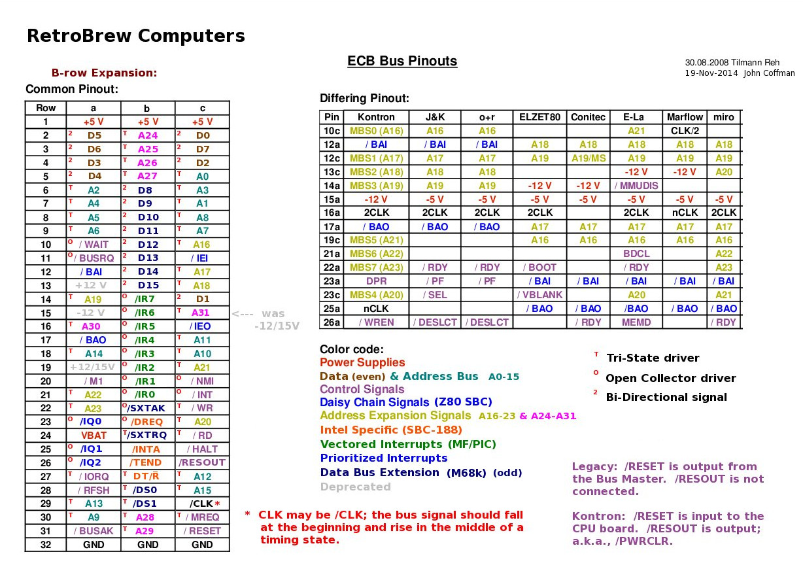

## ECB bus history

(https://www.retrobrewcomputers.org/doku.php?id=boards:ecb:start)

Below is an image depicting the latest definition of the ECB bus as utilized by the RetroBrew Computers group. It also addresses issues related to the /RESET and /RESOUT pin definitions and the solutions implemented. This design incorporates a 3-pin jumper header to allow for the selection of the appropriate configuration.



The German firm Kontron defined what is believed to be the earliest bus using the 96-pin DIN 41612 EuroCard connectors. The bus for their Z80 offering used only the A-row and C-row pins; the B-row was left entirely unused to allow for the use of 64-pin connectors in the 96-pin format.

The earliest known RetroBrew bus definition included B-row pin definitions to facilitate the anticipated expansion of the Z80 bus to other processors, particularly Intel. To this day, the ECB SBC v2 (Z80) does not use the B-row pins.

One error occurred in defining the first RetroBrew bus: confusion between signals RESET (C-31) and RESOUT (C-26). The error resulted in a bad guess at what Kontron's intentions were with these two signals. SBC v1 (Z80) used RESET as an output from the CPU board to peripheral boards and did not use the RESOUT signal at all. Peripheral boards were designed with this assumption. When it was pointed out several years ago (I am unsure of the date) that Kontron's intention was for RESET to be an input to the CPU board only and that the CPU board would then put out a signal, RESOUT, to all of the peripheral boards in the system.

The resolution to the above mistake is that all the newer CPU and peripheral boards have a reset selection jumper to select which RetroBrew reset convention is to be used. Look for a 3-pin jumper header: shorting pins 1-2 indicates the older, erroneous, reset convention for use with older boards; shorting pins 2-3 indicates the use of the Kontron convention. The Kontron convention is essential if RESET is to be received from any of the ECB backplanes, and only newer boards are allowed in such a system. Old CPU boards have a 2-pin Reset (in) connection as well as a reset switch right on the CPU card.

## Generate baud rate for 8251

### Response:

The **8253 Programmable Interval Timer (PIT)** can be used as a **baud rate generator** for serial communication by generating clock pulses at the required frequency. This is done by programming one of its three counters to divide an input clock signal down to the desired baud rate.

### Steps to Use 8253 as Baud Rate Generator

1. **Select the Counter:** 
   The 8253 has three counters (Counter 0, Counter 1, Counter 2). You need to choose one for generating the baud rate.

2. **Provide the Clock Input:**
   
   The 8253 typically receives a clock input (e.g., **1.8432 MHz or some
   other standard clock frequency**). Ensure the clock is stable and properly connected.

3. **Calculate the Divider Value:**  
   The baud rate is generated by dividing the input clock using a counter. The formula is:
   
    Input Frequency RateDivider=Baud RateClock Input Frequency​
   
   For example, if the input clock is **1.8432 MHz** and you need a baud rate of **9600**,
   the divider value is:
   
   1843200÷9600=192

4. **Program the 8253:**
   
   - Load the
     appropriate **mode** (typically Mode 2 – Rate Generator or Mode 3 – Square Wave).
   
   - Load the **divider value** into the selected counter.
   
   - Start the timer and route its output to the serial communication hardware (like 8251 USART or UART).

5. **Connect Output to Serial**
   Device: The output of the **8253 counter** is connected to the baud rate clock input of a serial communication device like the **8251 USART** or a UART module.

### Example: Setting Baud rate for 9600 using 1.8432 MHz Clock

- Use **Counter 0** of **8253**.

- Program it in **Mode 2 (Rate Generator)**.

- Load **192** as the divider value.

#### **Programming Steps (for an x86-based system)**

Assembly code


```
	MOV AL, 34H    ; Control Word: Counter 0, Mode 2, LSB/MSB
	OUT 43H, AL    ; Send control word to 8253
	MOV AL, 192    ; Load LSB (Least Significant Byte)
	OUT 40H, AL    ; Send LSB to Counter 0
	MOV AL, 0      ; Load MSB (Most Significant Byte)
	OUT 40H, AL    ; Send MSB to Counter 0
```

- **43H** → Control port of **8253**

- **40H** → Counter 0 data port

### **Modes Used in 8253 for Baud Rate**

- **Mode 2 (Rate Generator)** → Outputs a
   frequency suitable for baud generation.

- **Mode 3 (Square Wave Generator)** → Outputs a symmetrical square wave (useful in some applications).

### **Final Connection**

The **OUT0** pin of **8253** (if using Counter 0) is connected to the **clock input** of **8251 USART or UART** for serial communication.

### **Summary**

- Use **Mode 2 (Rate Generator)**

- Compute the **divider value** using the formula

- Program the **control word and counter value**

- Connect **output** to the **serial device** clock input.

This setup allows the **8253** to act as a **baud rate generator** for serial communication.

## Baud rate divider

As crystal frequency is 18.432 Mhz and it is outputted from I8224, we can use that frequency to generate baud rate clock signal for I8251. Below is the solution.


74LS390 contains two decade counters, where /CP0 → Q0 functions as a divider by 2, and /CP1 → Q1, Q2, Q3 operates as a divider by 5. We send an 18.432 MHz clock signal from I8224 to /CP1; it is divided by 5 and then fed to /CP0, where it is divided by 2. This arrangement will generate a square signal with an exact 50% duty cycle. The output signal from Q0 is then fed to the I8252 timer, where the appropriate baud rate can be generated.

### Shadow FLASH select logic

In the picture below you can see shadow FLASH select logic schematics.


After /RESET (at this point, the /SRAMSELECT signal from the IO decoder is HIGH), /SRAM_SEL is HIGH and /FLASH_SEL is LOW. Now /SRAM_OE is HIGH (the DATA from RAM are in high impedance, although writing is not prohibited), so the /RD signal has no effect on /SRAM_OE. Only changes in /MEMRQ will impact the /FLASH_MREQ signal, which means that only FLASH memory can be accessed, either for reading or for writing. So it is also possible to flash the memory using a programmer connected to the ECB bus. A simulation has also been conducted in Verilog (via iVerilog) and can be seen below.


```
/*
 Test bench
*/

`timescale 10ns/10ns

module shadow_flash_select_logic_tb();

   reg MEMRQ, RESET, SRAMSEL, RD;
   wire SRAM_SEL, FLASH_SEL, SRAM_OE, FLASH_MEMRQ;

   initial begin
      $dumpfile ("shadow_flash_select_logic.vcd");
      $dumpvars;
   end

  initial begin
     RESET = 1;
     #10
     RESET = 0;
     #5
     RESET = 1;
  end

  initial begin
     SRAMSEL = 1;
     RD = 1;
     MEMRQ = 1;
  end

  initial begin
     #50;
       RD = 0;
     #50;
       RD = 1;
     #50;
       MEMRQ = 0;
     #50;
       MEMRQ = 1;
     #50
       SRAMSEL = 0;
     #50
       RD = 0;
     #50
       RD = 1;
     #50
       MEMRQ = 0;
     #50
       MEMRQ = 1;
 end

  initial begin
    #500;
    $finish;
  end

   // The Netlist
   nand(SRAM_SEL, RESET, FLASH_SEL);
   nand(FLASH_SEL, SRAMSEL, SRAM_SEL);
   or(SRAM_OE, SRAM_SEL, RD);
   or(FLASH_MREQ, FLASH_SEL, MEMRQ); 

endmodule

```


Simulation result in gtkwave is shown below.


### ECB bus data direction

As we also have to send and read data from the ECB bus, we have to make sure that bus data buffers are properly directed if there is a bus request (BUSRQ) from the bus itself.

Signal DATA_DIR Select the direction of the data buffer. If DATA_DIR is log 0, data direction is from the board to the ECB bus, and if DATA_DIR is log 1, 1data can flow from the ECB bus to the board.

This is done by the circuit below. Basically, the upper part (/MEMRQ, /RD, /IOSEL, which is low when internal peripherals are selected) takes care of standard operations, and the upper part is involved when there is a request from the ECB bus. (/RD, /BUSAK)


Below you can see simulation code and simulation result.


```
/*
 Test bench
*/

`timescale 10ns/10ns

module shadow_flash_select_logic_tb();

   reg MREQ, IOSEL, RD, BUSAK;
   wire DATA_DIR, MREQ_IOSEL, RD_BUSAK, DATAEN;

   initial begin
      $dumpfile ("ecb_data_dir_logic.vcd");
      $dumpvars;
   end

  initial begin
    MREQ = 1;
    IOSEL = 1;
    RD = 1;
    BUSAK = 1;
/* MREQ and RD */
    #50
      MREQ = 0;
    #10
      RD = 0;
    #50
      RD = 1;
    #10
      MREQ = 1;
/* IOSEL and RD */
    #50
      IOSEL = 0;
    #10
      RD = 0;
    #50
      RD = 1;
    #10
      IOSEL = 1;
/* BUSAK and RD */
    #50
      BUSAK = 0;
    #50
      BUSAK = 1;
    #50
      RD = 0;
    #50
      RD = 1;
  end

  initial begin
    #500;
    $finish;
  end

   // The Netlist
   and(MREQ_IOSEL, MREQ, IOSEL);
   nand(RD_BUSAK, RD, BUSAK);
   or(RD_MREQ_IOSEL, MREQ_IOSEL, RD);
   and(DATA_DIR, RD_MREQ_IOSEL, RD_BUSAK);

endmodule

```

And the simulation result is below.


### Peripherals address space

Internal peripherals are selected by the following decoder.


The address space with this circuit is 0x40 – 0x7f.

Where base addresses of peripherals are in the following table.

|                                                   |               |
| ------------------------------------------------- | ------------- |
| Peripheral                                        | Address range |
| PIC 8259A                                         | 0x40 – 047    |
| PIT 8253                                          | 0x48 - 0x4F   |
| SIO 8251                                          | 0x50 - 0x57   |
| RAM bank/ SD card select register (/BANK/SD_SEL ) | 0x58 - 0x5F   |
| RAM select signal (/SRAMSEL)                      | 0x78 - 0x7F   |

Below is verilog simulation result for the decoder.


And the source code. I intentionally use primitives for simulation of 74LS138 to prevent some simulation glitches I got when I tried to use behavioral modeling. It is quite simplified as I’ve just wanted to verify address space for peripherals.


```
/*
 Test bench
*/

`timescale 10ns/10ns

module SN74LS138(input [2:0] ADDR, input E0_n, E1_n, E2, output wire [7:0] Y_n);

  not(E2_n, E2);
  nor(ENBL, E2_n, E0_n, E1_n);
  not(A_n, ADDR[0]);
  not(B_n, ADDR[1]);
  not(C_n, ADDR[2]);
  not(A, A_n);
  not(B, B_n);
  not(C, C_n);
  nand(Y_n[0], A_n, B_n, C_n, ENBL);
  nand(Y_n[1], A, B_n, C_n, ENBL);
  nand(Y_n[2], A_n, B, C_n, ENBL);
  nand(Y_n[3], A, B, C_n, ENBL);
  nand(Y_n[4], A_n, B_n, C, ENBL);
  nand(Y_n[5], A, B_n, C, ENBL);
  nand(Y_n[6], A_n, B, C, ENBL);
  nand(Y_n[7], A, B, C, ENBL);

endmodule

module peripheral_decoder_tb();
  reg  [7:0] ADDRESS = 0;
  reg  A6, A7, IORQ_n;
  wire [7:0] OUT;
  wire A7_n, A7_A6, IOSEL_n, PIC_SEL_n, PIT_SEL_n, SIO_SEL_n, SD_SEL_n, BANK_SD_SEL_n;
  integer I = 0;

   initial begin
      $dumpfile ("peripheral_decoder.vcd");
      $dumpvars;
   end

  initial begin
    IORQ_n = 0;
    ADDRESS = 'h00;
    for ( I = 'h3F ; I < 'hff; I = I + 1) begin
      #5 ADDRESS = I;
    end

  end

  initial begin
    #350;
    $finish;
  end
  assign PIC_SEL_n = OUT[0];
  assign PIT_SEL_n = OUT[1];
  assign SIO_SEL_n = OUT[2];
  assign SD_SEL_n = OUT[3];
  assign BANK_SD_SEL_n = OUT[7];
  // The Netlist
  SN74LS138 ls138(ADDRESS[5:3], IOSEL_n, IOSEL_n, 1'b1 , OUT);
  not(A7_n, ADDRESS[7]);
  nand(A7_A6, A7_n, ADDRESS[6]);
  or(IOSEL_n, A7_A6, IORQ_n);
endmodule

```
